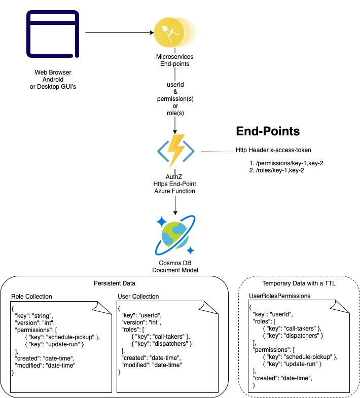

# Azure Authorization Service

## Objectives

* A single-concern service responsible for application permission/role checking
* Accepts `access_token` for caller identity as an Http Header and permission(s) or role(s) as url path params
* Returns a yes/no answer for each permission/role requested
* The service does not implement any meaning for permissions or roles
* The calling GUI/Service provides an interpretation for the role/permission
* The service does not provide authorization data management functionality, a separate end-point will address these concerns

## Design



* The decision was not to rely on Azure AD user groups to eliminate dependency on IT personnel
* The service is solely responsible for high performance and availability
* The service will leverage Cosmos DB with Document API for high performance and availability
* The owner of the service may decide to implement a caching strategy in case of performance issues detected
* During the transition period from Legacy to SaaS implementation, authorization data will be replicated from the legacy db

## End-points

### Permissions

The end-point will validate access token before processing the request

#### Request

Verb: GET  
Http Headers: 
* x-access-token: the token issued by authentication end-point
* x-correlation-id: optional header for traceability

Path: `/permissions/key-1,key2`

#### Response - Success

Status Code: 200
Body:
```
{
    "userId": "UserPrincipalName ",
    "correlationId": "xxxxxxxxxxxxxxxxxxxxxxxxxx",
    "timestamp": "12/16/2019 19:07:54",
    "permissions": [
        {
            "key": "schedule-pickup",
            "isAuthorized": true
        },
        {
            "key": "dispatechers",
            "isAuthorized": false
        }
    ]
}
```

### Roles

The end-point will validate access token before processing the request

#### Request

Verb: GET  
Http Headers: 
* x-access-token: the token issued by authentication end-point
* x-correlation-id: optional header for traceability

Path: `/roles/key-1,key2`

#### Response - Success

Status Code: 200
Body:
```
{
 "userId": "UserPrincipalName ",
    "correlationId": "xxxxxxxxxxxxxxxxxxxxxxxxxx",
    "timestamp": "12/16/2019 19:07:54",
    "roles": [
        {
            "key": "schedule-pickup",
            "isAuthorized": true
        },
        {
            "key": "dispatechers",
            "isAuthorized": false
        }
    ]
}
```
